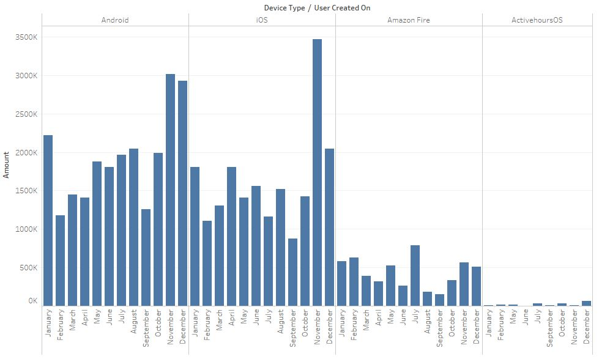
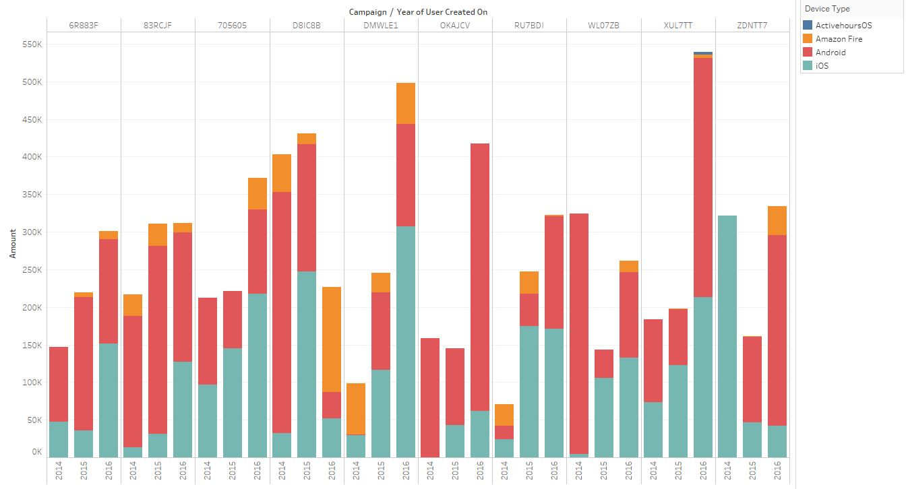
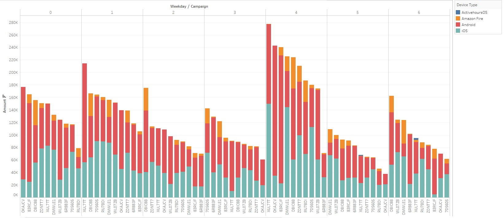

# E-Commerce Data Analysis and Visualizations

The following case study highlights use of **Tableau** for Exploratory Data Analysis of E-Commerce Marketing Data

An E-commerce company ran marketing campaigns to generate sales. They collected information on the type of device each customer used, the sale amount, total transaction for each day, etc. Here, we analyzed the performance of the various marketing campaigns and understood its relationship with respect to user interaction and total sales. Finally, steps to improve campaign performance are discussed.

Original dataset can be accessed [here](https://raw.githubusercontent.com/gauravhassija/E-Commerce-Data-Analysis/master/final_df.csv).

## Exploratory Data Analysis
### Data Dictionary
Data Dictionary explains what each column of the dataset represents

Column Name | Description
------------|------------
device_created_on	| Device creation Timestamp
device_type	| Type of Device
operating_system	| Operating System on which user accessed the app
attribution_created_on	| Attribution Campaign Timestamp
campaign	| Marketing campaign name
user_id	| User Id
user_created_on	| User creation Timestamp
name	| User name
amount	| Transaction amount
sale_created_on	| Sale creation Timestamp
sale_id	| Sale Id
date	| Sale created day
weekday	| Day on which sale happened
item_id	| Item Id

### 1. Relationship between Device Type and User Creation

Original visualization can be accessed [here](https://public.tableau.com/profile/gaurav.hassija8030#!/vizhome/Gaurav-Hassija-Final/EDA1).

This graph shows the monthly trend between User creation and type of device used.

One thing to observe here is that high number of users are created in November and December. This can be due to the holiday season and not entirely due to the marketing efforts.

**Recommendation:** As customers are in the mood of buying new items during holiday season, the competition for ad space will be high. Marketing efforts should be stepped up to capture every possible customer.

### 2. Relation between Marketing Campaigns and User creation

Original visualization can be accessed [here](https://public.tableau.com/profile/gaurav.hassija8030#!/vizhome/Gaurav-Hassija-Final/EDA2).

This chart shows the performance of top 10 Marketing campaigns by User creation for each year.

Furthermore, we can also see the break-up with respect to each device.

'Android' is the top performing device across all campaigns.

### 3. Relation between Campaigns and Weekday

Original visualization can be accessed [here](https://public.tableau.com/profile/gaurav.hassija8030#!/vizhome/Gaurav-Hassija-Final/EDA3).

This graph shows the trend between sum amount of sale for top 10 campaigns across weekdays.

We can also observe the type of device used by the customer.

Weekday 4 has the highest amount of sale as compared to other days.

**Recommendation:**

* 'ActivehoursOS' can be removed from the marketing campaigns as the sale is extremely low as compared to other devices.
* More campaigns can be scheduled for Weekday 3 and Weekday 5 to improve sales.

## Conclusion

* The response of users is good with respect to the marketing campaigns
* Holiday season shows high number of transactions, stepping up the marketing efforts during this time will be beneficial
* Furthermore, device selection for marketing campaigns should be revised. Focusing on popular devices will yield better results
* Finally, the overall marketing effort needs to be refined and enhanced; improving the efforts should provide healthier results
